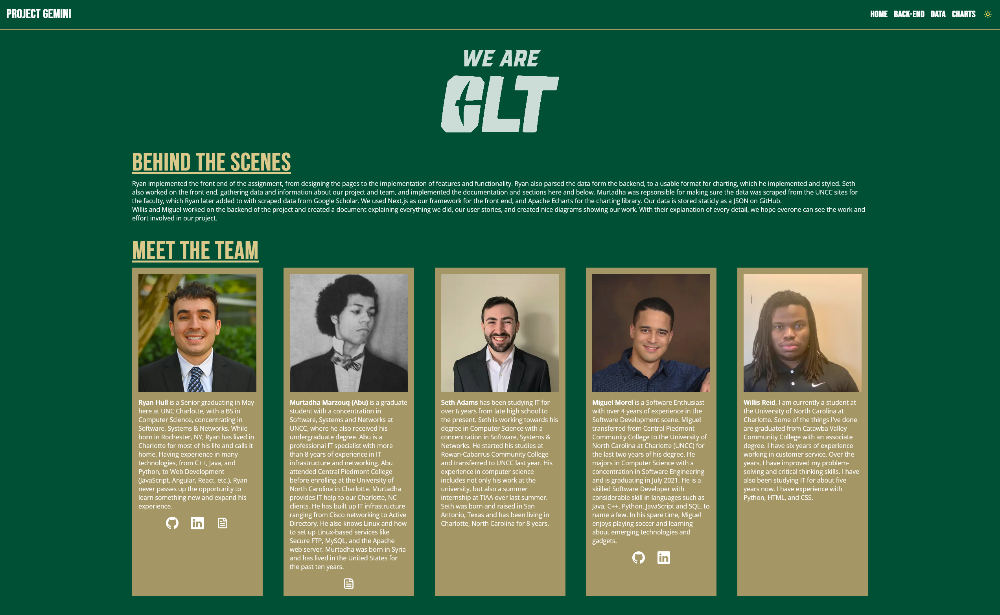
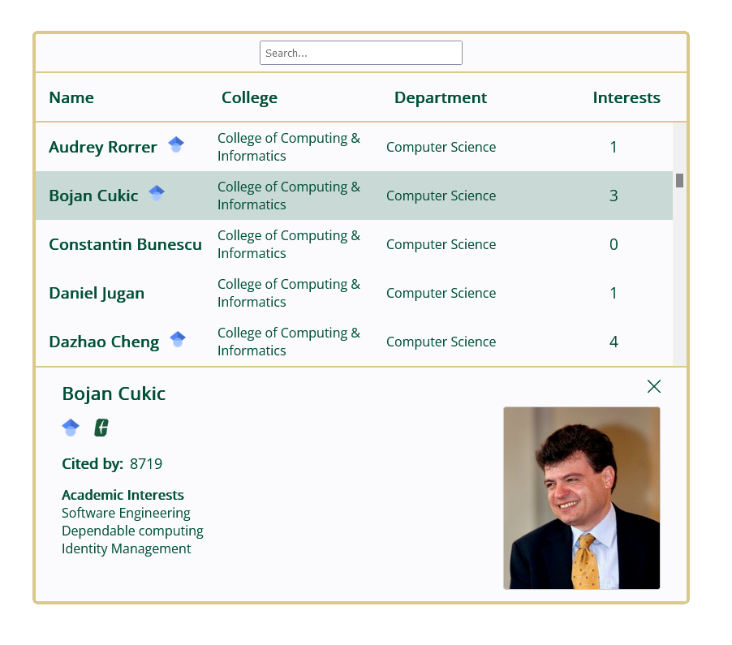
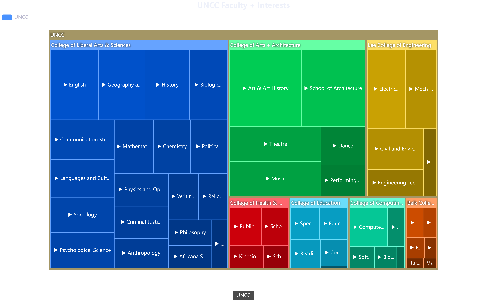

<div id="top"></div>

[![LinkedIn][linkedin-shield]][linkedin-url]

<!-- PROJECT LOGO -->
<br />
<div align="center">
  <a href="https://github.com/othneildrew/Best-README-Template">
    
  </a>

  <h3 align="center">ITSC 4155 - Capstone Project Front End</h3>

  <p align="center">
    UNC at Charlotte - Faculty Connections & Google Scholar
    <br/>
    Scraping and Data Visualization
    <br />
    <a href="https://capstone-front-end-lime.vercel.app/">View Live Project</a>
    <br />
    <br />
    This repository holds the Front-End of our Capstone Project.
    <br />
To see the back-end led by <a href="https://github.com/MurtadhaM">Murtadha Marzouq</a>, 
please visit the <a href="https://github.com/MurtadhaM/ITSC-4155">Back-End repository</a>.
  </p>
</div>

<!-- TABLE OF CONTENTS -->
<details>
  <summary>Table of Contents</summary>
  <ol>
    <li>
      <a href="#about-the-project">About The Project</a>
      <ul>
        <li><a href="#built-with">Built With</a></li>
      </ul>
    </li>
    <li><a href="#main-features">Main Features</a>
    <ul>
        <li><a href="#search">Search</a></li>
        <li><a href="#charts">Charts</a></li>
      </ul>
    </li>
    <li>
      <a href="#getting-started">Getting Started</a>
      <ul>
        <li><a href="#prerequisites">Prerequisites</a></li>
        <li><a href="#installation">Installation</a></li>
      </ul>
    </li>
    <li><a href="#license">License</a></li>
    <li><a href="#contact">Contact</a></li>
  </ol>
</details>

## About The Project

<a href="https://capstone-front-end-lime.vercel.app">
  <p align="center">
    
  </p>
</a>

There are many issues students face when it comes to research or writing papers, knowing where to start. Often students are reccomended to check their school's local online library resources, or services like Google Scholar. While these services are great for in depth research, what if a student wanted to find an expert or faculty with an interest in their researched topic from their own school? We set to find a solution for this, where students can search for an interest topic or faculty member, and visualize the aggregate data about our schools faculty members and interests -- We think this is it.

What we provide:

- Responsive searchable aggregate data table for all UNC at Charlotte's faculty members
- Scraped information from UNC at Charlotte and Google Scholar sources
- Data visualization for large data sets to understand interests at Charlotte

Of course, this project is built for our home here at UNC at Charlotte, but we hope to provide insight for other solutions for other organizations and data sets.

### Built With

#### Front-End

- [Next.js](https://nextjs.org/)
- [React.js](https://reactjs.org/)
- [Apache ECharts](https://echarts.apache.org/en/index.html/)
- [Echarts-for-react](https://www.npmjs.com/package/echarts-for-react/)
- [React Icons](https://react-icons.github.io/react-icons/)

#### Back-End

- [Python](https://www.python.org/)
- [Beautiful Soup](https://beautiful-soup-4.readthedocs.io/en/latest/)
- [Pandas](https://pandas.pydata.org/)
- [Scholarly](https://scholarly.readthedocs.io/en/stable/quickstart.html)

## Main Features

### Search

- Responsive searchable table where users can search for a faculty name or interest
- Displays links to UNC at Charlotte Faculty page, and Google Scholar page if available

<a href="https://capstone-front-end-lime.vercel.app/data">
  <p align="center">
    
  </p>
</a>

### Charts

- Responsive traversable charts where users can view College, Department, and Faculty interest statistics

<a href="https://capstone-front-end-lime.vercel.app/charts">
  <p align="center">
    
  </p>
</a>

<p align="right"><a href="#top">back to top</a></p>

## Getting Started

Follow this quick guide to run this project locally

### Prerequisites

- npm

### Run Project Locally

1. Clone the repo

   ```sh
   git clone https://github.com/HullRyan/CapstoneFrontEnd
   ```

2. Install NPM packages

   ```sh
   npm install
   ```

3. Run the Next.js project

   ```sh
   npm run dev
   ```

## License

Distributed under the MIT License

## Contact

Ryan Hull - hull.ryanc@gmail.com

Project Link: [https://github.com/HullRyan/CapstoneFrontEnd](https://github.com/HullRyan/CapstoneFrontEnd)

<p align="right"><a href="#top">back to top</a></p>

[linkedin-shield]: https://img.shields.io/badge/-LinkedIn-black.svg?style=for-the-badge&logo=linkedin&colorB=555
[linkedin-url]: https://www.linkedin.com/in/ryan-hull-478b64178